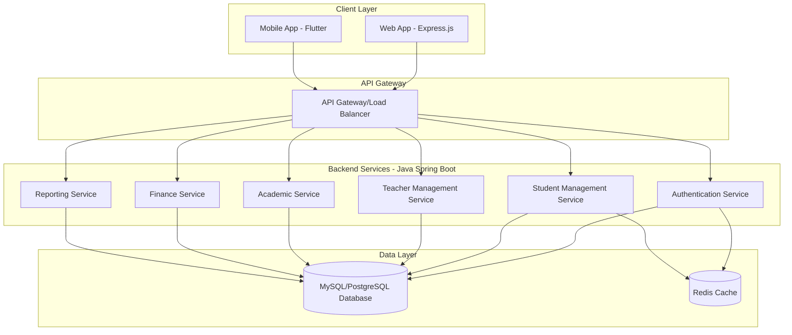
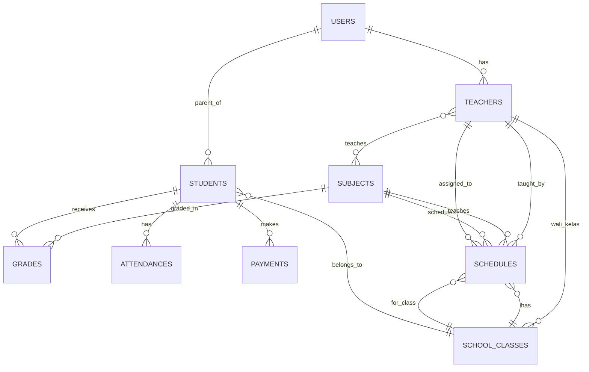

# Design Document - SIM Sekolah

## Overview

Sistem Informasi Manajemen (SIM) Sekolah adalah transformasi dari aplikasi HRM dan Penggajian dengan arsitektur 3-tier:
- **Backend**: Java (Spring Boot) untuk REST API dan business logic
- **Frontend**: Express.js untuk web application
- **Mobile**: Flutter untuk aplikasi mobile

Sistem menggunakan pola arsitektur microservices dengan database relational untuk mengelola data sekolah secara komprehensif.

## Architecture

### High-Level Architecture



### Technology Stack

**Backend (Java)**
- Spring Boot 3.x
- Spring Security untuk authentication/authorization
- Spring Data JPA untuk database operations
- Maven untuk dependency management
- JWT untuk token-based authentication

**Frontend (Express.js)**
- Express.js framework
- EJS atau Handlebars untuk templating
- Bootstrap untuk UI components
- Axios untuk API calls
- Session management

**Mobile (Flutter)**
- Flutter SDK
- HTTP package untuk API integration
- Provider untuk state management
- Shared Preferences untuk local storage

**Database**
- MySQL atau PostgreSQL
- Redis untuk caching dan session storage

## Components and Interfaces

### Backend Services

#### 1. Authentication Service
```java
@RestController
@RequestMapping("/api/auth")
public class AuthController {
    @PostMapping("/login")
    public ResponseEntity<AuthResponse> login(@RequestBody LoginRequest request);
    
    @PostMapping("/logout")
    public ResponseEntity<Void> logout(@RequestHeader("Authorization") String token);
    
    @GetMapping("/profile")
    public ResponseEntity<UserProfile> getProfile(@RequestHeader("Authorization") String token);
}
```

#### 2. Student Management Service
```java
@RestController
@RequestMapping("/api/students")
public class StudentController {
    @GetMapping
    public ResponseEntity<List<Student>> getAllStudents();
    
    @PostMapping
    public ResponseEntity<Student> createStudent(@RequestBody Student student);
    
    @PutMapping("/{id}")
    public ResponseEntity<Student> updateStudent(@PathVariable Long id, @RequestBody Student student);
    
    @DeleteMapping("/{id}")
    public ResponseEntity<Void> deleteStudent(@PathVariable Long id);
    
    @GetMapping("/{id}/grades")
    public ResponseEntity<List<Grade>> getStudentGrades(@PathVariable Long id);
}
```

#### 3. Academic Service
```java
@RestController
@RequestMapping("/api/academic")
public class AcademicController {
    @GetMapping("/classes")
    public ResponseEntity<List<SchoolClass>> getAllClasses();
    
    @GetMapping("/subjects")
    public ResponseEntity<List<Subject>> getAllSubjects();
    
    @GetMapping("/schedules")
    public ResponseEntity<List<Schedule>> getSchedules();
    
    @PostMapping("/grades")
    public ResponseEntity<Grade> addGrade(@RequestBody Grade grade);
    
    @GetMapping("/attendance/{classId}")
    public ResponseEntity<List<Attendance>> getClassAttendance(@PathVariable Long classId);
}
```

### Frontend Components (Express.js)

#### Route Structure
```javascript
// routes/index.js
app.use('/', require('./dashboard'));
app.use('/students', require('./students'));
app.use('/teachers', require('./teachers'));
app.use('/classes', require('./classes'));
app.use('/grades', require('./grades'));
app.use('/finance', require('./finance'));
app.use('/reports', require('./reports'));
```

#### Middleware
```javascript
// middleware/auth.js
const authenticateToken = (req, res, next) => {
    const token = req.session.token;
    if (!token) return res.redirect('/login');
    // Verify JWT token with backend
    next();
};

// middleware/role.js
const authorizeRole = (roles) => {
    return (req, res, next) => {
        if (!roles.includes(req.user.role)) {
            return res.status(403).render('error', { message: 'Access denied' });
        }
        next();
    };
};
```

### Mobile App Structure (Flutter)

#### Screen Architecture
```dart
// lib/screens/
- login_screen.dart
- dashboard_screen.dart
- student_list_screen.dart
- grade_input_screen.dart
- attendance_screen.dart
- profile_screen.dart

// lib/services/
- api_service.dart
- auth_service.dart
- student_service.dart
- grade_service.dart

// lib/models/
- user.dart
- student.dart
- grade.dart
- attendance.dart
```

## Data Models

### Core Entities

#### User Entity
```java
@Entity
@Table(name = "users")
public class User {
    @Id
    @GeneratedValue(strategy = GenerationType.IDENTITY)
    private Long id;
    
    @Column(unique = true)
    private String username;
    
    private String password;
    
    @Enumerated(EnumType.STRING)
    private UserRole role; // ADMIN, TEACHER, PARENT
    
    private String fullName;
    private String email;
    private String phone;
    private LocalDateTime createdAt;
    private LocalDateTime updatedAt;
}
```

#### Student Entity
```java
@Entity
@Table(name = "students")
public class Student {
    @Id
    @GeneratedValue(strategy = GenerationType.IDENTITY)
    private Long id;
    
    @Column(unique = true)
    private String nisn;
    
    private String fullName;
    private LocalDate birthDate;
    private String address;
    private String parentName;
    private String parentPhone;
    
    @ManyToOne
    @JoinColumn(name = "class_id")
    private SchoolClass schoolClass;
    
    @OneToMany(mappedBy = "student")
    private List<Grade> grades;
    
    @OneToMany(mappedBy = "student")
    private List<Attendance> attendances;
}
```

#### Teacher Entity
```java
@Entity
@Table(name = "teachers")
public class Teacher {
    @Id
    @GeneratedValue(strategy = GenerationType.IDENTITY)
    private Long id;
    
    @Column(unique = true)
    private String nip;
    
    private String fullName;
    private String email;
    private String phone;
    
    @ManyToMany
    @JoinTable(name = "teacher_subjects")
    private List<Subject> subjects;
    
    @OneToMany(mappedBy = "teacher")
    private List<Schedule> schedules;
}
```

#### Grade Entity
```java
@Entity
@Table(name = "grades")
public class Grade {
    @Id
    @GeneratedValue(strategy = GenerationType.IDENTITY)
    private Long id;
    
    @ManyToOne
    @JoinColumn(name = "student_id")
    private Student student;
    
    @ManyToOne
    @JoinColumn(name = "subject_id")
    private Subject subject;
    
    @Enumerated(EnumType.STRING)
    private GradeType type; // ASSIGNMENT, MIDTERM, FINAL
    
    private Double score;
    private String semester;
    private Integer academicYear;
    private LocalDateTime createdAt;
}
```

### Database Schema Relationships



## Error Handling

### Backend Error Handling
```java
@ControllerAdvice
public class GlobalExceptionHandler {
    
    @ExceptionHandler(StudentNotFoundException.class)
    public ResponseEntity<ErrorResponse> handleStudentNotFound(StudentNotFoundException ex) {
        ErrorResponse error = new ErrorResponse("STUDENT_NOT_FOUND", ex.getMessage());
        return ResponseEntity.status(HttpStatus.NOT_FOUND).body(error);
    }
    
    @ExceptionHandler(ValidationException.class)
    public ResponseEntity<ErrorResponse> handleValidation(ValidationException ex) {
        ErrorResponse error = new ErrorResponse("VALIDATION_ERROR", ex.getMessage());
        return ResponseEntity.status(HttpStatus.BAD_REQUEST).body(error);
    }
    
    @ExceptionHandler(UnauthorizedException.class)
    public ResponseEntity<ErrorResponse> handleUnauthorized(UnauthorizedException ex) {
        ErrorResponse error = new ErrorResponse("UNAUTHORIZED", "Access denied");
        return ResponseEntity.status(HttpStatus.UNAUTHORIZED).body(error);
    }
}
```

### Frontend Error Handling
```javascript
// utils/errorHandler.js
const handleApiError = (error, res) => {
    if (error.response) {
        const { status, data } = error.response;
        switch (status) {
            case 401:
                return res.redirect('/login');
            case 403:
                return res.render('error', { message: 'Access denied' });
            case 404:
                return res.render('error', { message: 'Data not found' });
            default:
                return res.render('error', { message: data.message || 'Server error' });
        }
    }
    return res.render('error', { message: 'Network error' });
};
```

### Mobile Error Handling
```dart
class ApiService {
  Future<T> handleRequest<T>(Future<Response> request, T Function(Map<String, dynamic>) fromJson) async {
    try {
      final response = await request;
      if (response.statusCode == 200) {
        return fromJson(response.data);
      } else {
        throw ApiException(response.statusCode, response.data['message']);
      }
    } on DioError catch (e) {
      if (e.response?.statusCode == 401) {
        // Redirect to login
        NavigationService.navigateToLogin();
      }
      throw ApiException(e.response?.statusCode ?? 0, e.message);
    }
  }
}
```

## Testing Strategy

### Backend Testing
```java
// Unit Tests
@ExtendWith(MockitoExtension.class)
class StudentServiceTest {
    @Mock
    private StudentRepository studentRepository;
    
    @InjectMocks
    private StudentService studentService;
    
    @Test
    void shouldCreateStudent() {
        // Test implementation
    }
}

// Integration Tests
@SpringBootTest
@AutoConfigureTestDatabase
class StudentControllerIntegrationTest {
    @Autowired
    private TestRestTemplate restTemplate;
    
    @Test
    void shouldCreateStudentEndpoint() {
        // Test implementation
    }
}
```

### Frontend Testing
```javascript
// routes/students.test.js
const request = require('supertest');
const app = require('../app');

describe('Student Routes', () => {
    test('GET /students should return student list', async () => {
        const response = await request(app)
            .get('/students')
            .expect(200);
        
        expect(response.text).toContain('Student List');
    });
});
```

### Mobile Testing
```dart
// test/services/student_service_test.dart
void main() {
  group('StudentService', () {
    test('should fetch students successfully', () async {
      // Mock HTTP client
      final mockClient = MockClient();
      final studentService = StudentService(client: mockClient);
      
      // Test implementation
    });
  });
}
```

### End-to-End Testing
- Selenium untuk web application testing
- Flutter integration tests untuk mobile
- Postman/Newman untuk API testing
- Database migration testing

## Security Considerations

### Authentication & Authorization
- JWT tokens dengan expiration time
- Role-based access control (RBAC)
- Password hashing dengan BCrypt
- Session management untuk web app

### Data Protection
- Input validation dan sanitization
- SQL injection prevention dengan JPA
- XSS protection dengan CSP headers
- HTTPS enforcement

### API Security
- Rate limiting
- CORS configuration
- API versioning
- Request/response logging untuk audit trail